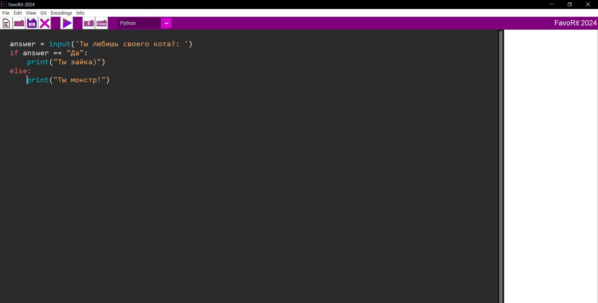

<h1 align="center">FavoRit 2024</h1>
FavoRit is a new line of source code editors created by the developer of filcher for such operating systems as Windows and Linux. It is a simple code editor for working with such programming languages as Python, C++, C#, HTML and CSS.
<h1 align="center">Program functions</h1>
<table class="iksweb">
		<tr>
			<td>Basic Function</td>
			<td>Syntax highlighting of programming language, More detailed work with files, Return/Remove last action, Writing number of lines in a file, Debugging code for almost all programming languages, Opening folders in the program</td>
		</tr>
		<tr>
			<td>Additional features</td>
			<td>Additional themes that users can create for their own interface customization, Built-in work with the Git version control system, Automatic program updates without human intervention</td>
		</tr>
</table>
<h1 align="center">Screenshot</h1>

